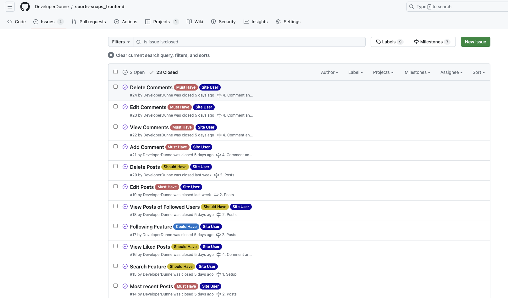
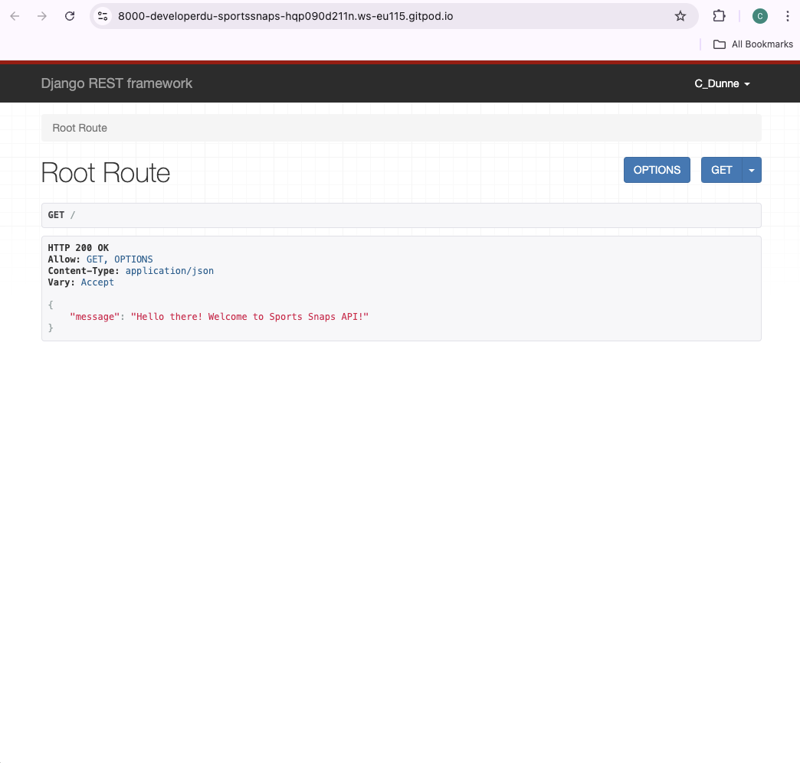
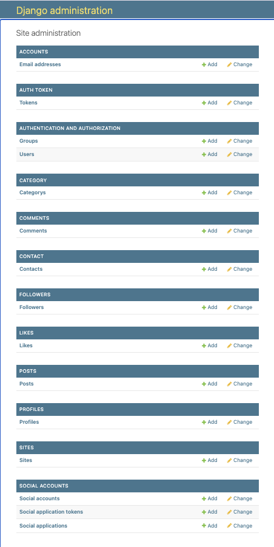
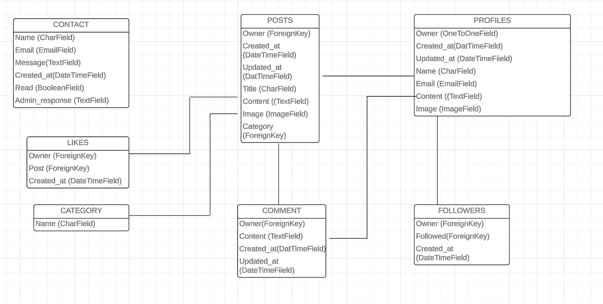
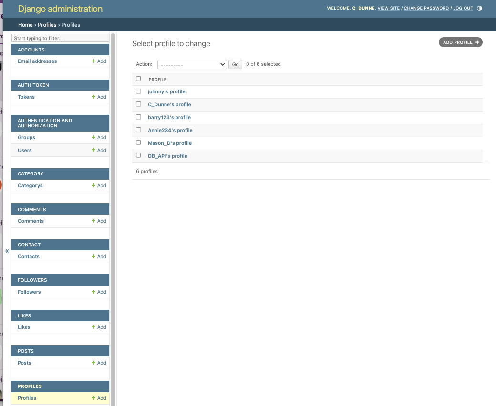
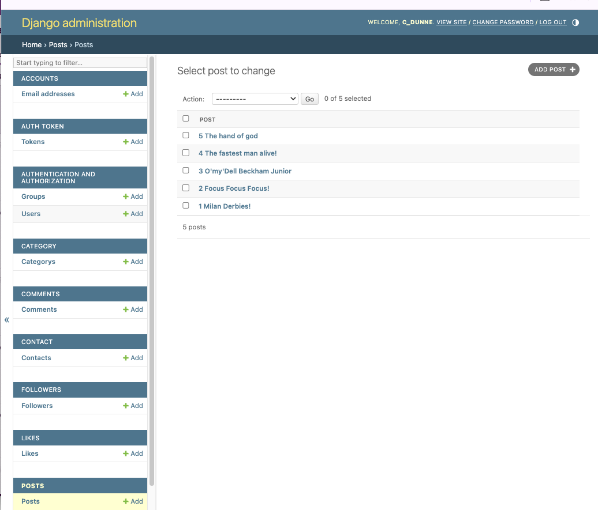
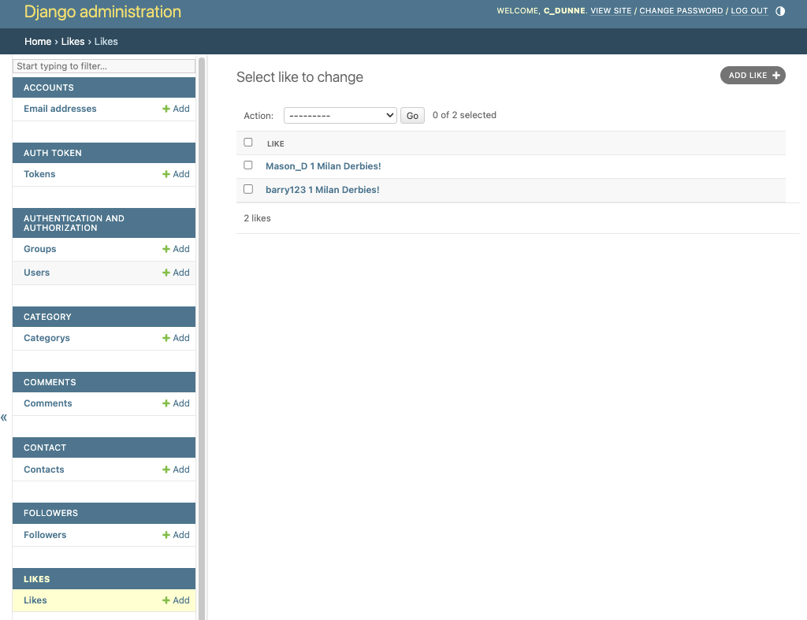
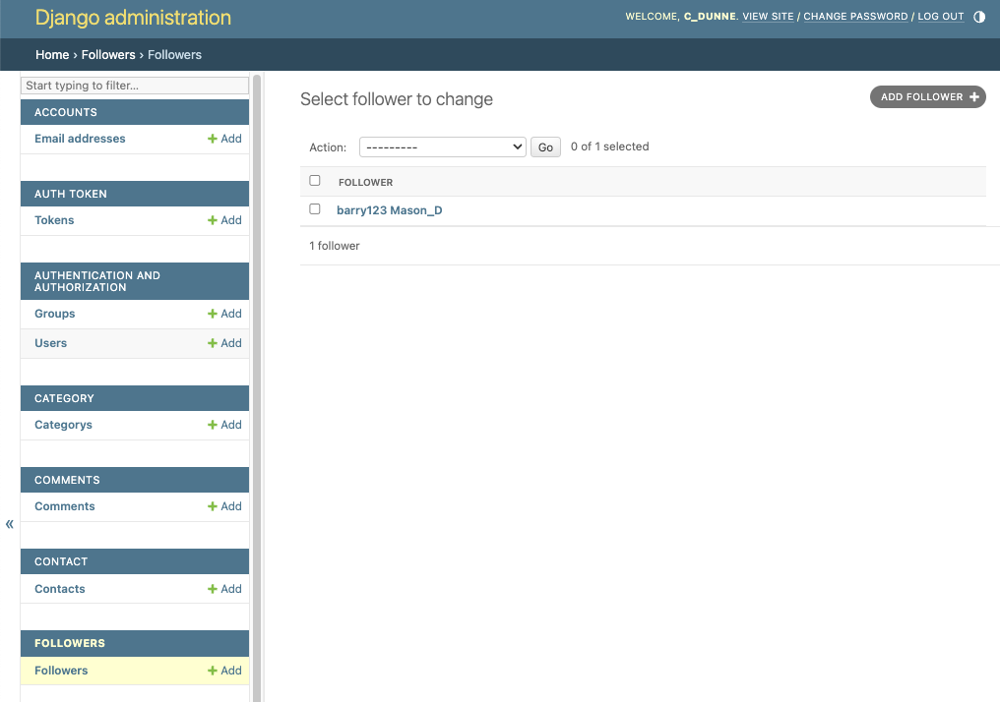
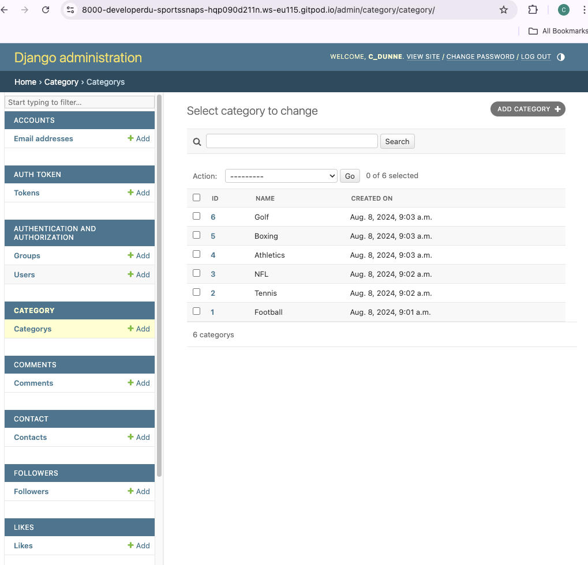
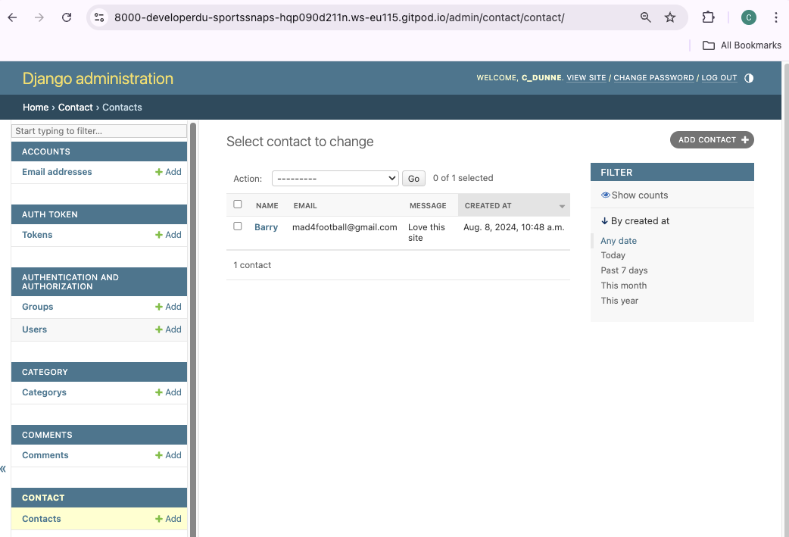

# Sports Snaps - API 

Sports Snaps API is a Django-based web application for the website [Sports Snaps](https://sportssnaps-37b7ee6411c9.herokuapp.com/). The website is a social media platform designed for users to share their most liked sporting photos or moments.

# Site Repositories

[Frontend Repository](https://github.com/DeveloperDunne/sports-snaps_frontend)

[API Repository](https://github.com/DeveloperDunne/Sports-Snaps-API)

# Table of contents

- [1. Planning](#planning)
- [2. Admin](#admin)
- [3. Relationships and Endpoints](#relationships-and-endpoints)
- [4. Testing](#testing)
- [5. Languages and Technologies](#languages-and-technologies)
- [6. Installed Packages](#installed-packages)
- [7. Security](#security)
- [8. Setup](#setup)
- [9. Deployment](#heroku-deployment)
- [10. Credits](#credits)

# Planning

## Agile Methodology

* All functionality and development of this project were managed using GitHub Projects. This can be found here at [Github Projects](https://github.com/users/DeveloperDunne/projects/6/views/1).

## MoSCoW

This project used the "MoSCoW" method to classify features and requirements according to their importance towards a minimum viable product (MVP). "MoSCoW" stands for "Must have, Should have, Could have and Won't have," with each classification aiding in the prioritization of features. This method makes sure that essential components are tackled in priority order.

# Admin

## Root Admin View

## Admin Panel

## Superusers
Superusers can perform the following via the admin panel:

CRUD Posts
CRUD Comments
CRUD Profiles
CRUD Contacts
CRUD Category
Change Passwords
Change emails

# Relationships and Endpoints

## Profile
- created_at(DateTimeField),
- updated_at(DateTimeField),
- name(CharField),
- email(EmailField),
- content(TextField),
- image(ImageField),
- facebook_link(URLField),
- twitter_link(URLField) and
- instagram_field(URLField)

### Endpoints:
- /profiles/: to list (GET) profiles.
- /profiles/:id/: to show (GET) or update (PUT) a profile.

## Post
- owner(ForeignKey),
- created_at(DateTimeField),
- updated_at(DateTimeField),
- title(CharField),
- content(TextField),
- image(ImageField),
- category(ForeignKey)

### Endpoints:
- /posts/: to list (GET) or create (POST) posts.
- /posts/:id/: to show (GET), update (PUT) or delete (DELETE) a post.

## Comments
- owner(ForeignKey),
- content(TextField),
- created_at(DateTimeField),
- updated_at(DateTimeField)

### Endpoints:
- /comments/: to list (GET) all comments or create (POST) a new comment.
- /comments/:id/: to show (GET) a specific comment, update (PUT) or delete (DELETE) a comment.

## Likes
- post(ForeignKey) and
- created_at(DateTimeField)

### Endpoints:
- /likes/: to list (GET) or create (POST) likes.
- /likes/:id/: to show (GET) or delete (DELETE) a like.

## Followers 
- owner(ForeignKey),
- followed(ForeignKey),
- created_at(DateTimeField)

### Endpoints:
- /followers/: to list (GET) profiles.
- /followers/:id/: to show (GET) or delete (DELETE) a follow.

## Category
- name(CharField)

### Endpoints:
- /category/: to list (GET) categories.

## Contact
- email(EmailField),
- subject(Charfield),
- message(TextField),
- created_at(DateTimeField),
- read(BooleanField),
- admin_response(TextField)

# Testing

Manual Testing for the overall functionality of the API was performed by entering test data in the backend both via Backend and Front-end. 

There was one error which I was unable to fix and even a few tutors couldnt manage to fix. When running the server in my API the termial asked for me to include 'allauth.account.middleware.AccountMiddleware' into Middleware. Unfortunately this caused the API to not deploy correctly in Heroku therefore I had to comment it out for deployment and then uncomment it and save if I required access to the admin Panel.

Please see testing for a breakdown of issue.

Detailed testing documentation can be found here [TESTING.MD](/TESTING.MD)

# Languages and Technologies

- Django REST Framework (Python Framework - API)
- PostgreSQL from CI

# Installed Packages

The following packages were installed when developing this project: 

To install, the following command was run in the terminal: pip3 install ...

- asgiref==3.8.1
- cloudinary==1.40.0
- dj-database-url==0.5.0
- dj-rest-auth==2.1.9
- Django==5.0.7
- django-allauth==0.50.0
- Django-Cloudinary-storage==0.3.0
- django-cors-headers==4.4.0
- Django-filter==24.2
- djangorestframework==3.15.2
- - djangorestframework-simplejwt==5.3.1
- gunicorn==22.0.0
- oauthlib==3.2.2
- pillow==10.4.0
- psycopg2==2.9.9
- PyJWT==2.8.0
- python3-openid==3.2.0
- requests-oauthlib==2.0.0
- setuptools==68.0.0
- sqlparse==0.5.1

# Security

### env.py File

API keys and databases are stored in the env.py which is not included in version control to prevent exposure.

# Setup

### GitHub

The project was developed using GitHub and coded via the IDE GitPod.

- Navigate to: "Repositories" and create "New".
- Mark the following field: ✓ Public
- Select template: "Code-Institute-Org/react-ci-template".
- Add a Repository name then create Repository.

### Terminal Commands

Commits:

- git add . 
- git commit -m "commit message"
- git push

To run the server locally (Debug = True), the following command ran:
- `python manage.py runserver` <- Loads the website on the in-built Terminal.

During development migrations to the database were made.
To make migrations the following commands ran:
- `python manage.py makemigrations` <- Creates a new database migration
- `python manage.py migrate` <- Applies pending migrations

To create or update Requirements.txt file the following commands ran:
- `pip3 freeze --local > requirements.txt`  <-Runs the req.
- `pip install -r requirements.txt` <- Install req.

To create a Superuser the following command ran (from Heroku terminal): 
- `python manage.py createsuperuser` (username->email->password1->password2) <- Creates a Superuser

To create a new Django project, in the currenct directory, the followig command ran:
- `django-admin startproject NAMEOFTHEPROJECT .` <- Starts the project

To create the app the following command ran:
- `python3 manage.py startapp NAMOFTHEAPP` <- Creates a folder for the app withing the project

## Heroku Deployment

This project is deployed on Heroku, a cloud platform service that enables deployment for web applications. The deployment process includes the following steps:

### Initial Setup

1. **Create a Heroku Account**: Sign up for a Heroku account at [Heroku's website](https://www.heroku.com/).

2. **Install Heroku CLI**: Download and install the Heroku Command Line Interface (CLI) to interact with Heroku from your local machine.

### Preparing the Application

1. **Procfile**: Create a `Procfile` in your project root directory. This file tells Heroku how to run your application.
2. **Requirements.txt**: Ensure you have a `requirements.txt` file listing all project dependencies.
3. **Config Vars**: Set up necessary configuration variables in Heroku (i.e `SECRET_KEY`, `DATABASE URL`).

### Deployment

1. **Create a Heroku App**: Use the Heroku CLI to create a new app.
2. **Add Buildpacks**: If necessary, add the correct buildpacks via the Heroku dashboard or CLI.
3. **Deploy**: Push your code to Heroku either by connecting your GitHub repository to Heroku or using the Heroku CLI to deploy your application.
4. **Database Migration (if applicable)**: Run database migrations using the Heroku CLI.

### Final Steps

1. **Enable the Web Dyno**: Make sure the web dyno is up and running after deployment.
2. **Open the App**: You can open your application from the Heroku dashboard or using the CLI command `heroku open`.

## How to Fork

To fork a repository on GitHub, follow these steps:

- Log in to GitHub - or set up a new account.
- Click on the repository name.
- Click the Fork button in the top right corner.

## How to Clone

To clone a repository on GitHub, follow these steps:

- Log in to GitHub - or set up a new account.
- Find or create your repository.
- Click on the code button, select whether you would like to clone with HTTPS, SSH or GitHub CLI and copy the link shown.
- Open the terminal in your code editor and change the current working directory to the location you want to use for the cloned directory.
- Type 'git clone' into the terminal and paste the link you copied in step 3. Press enter.

# Credits

All credits and acknowledgments have been detailed in the main [Frontend Repo README document](https://github.com/DeveloperDunne/sports-snaps_frontend/blob/main/README.md).
 